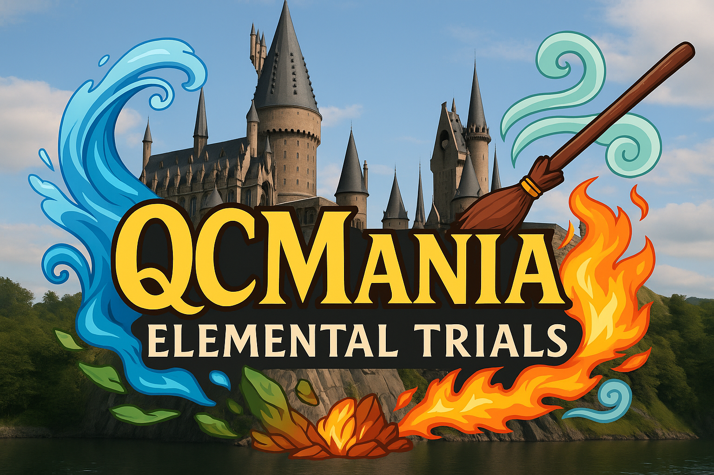

<p align="center">
  
</p>

# QCMania Overlay

A magical, animated, Google Sheets-powered scoreboard overlay for the **QCMania Elemental Trials**. Designed to be streamed live via Twitch or OBS.

---

## 🔮 About the Project

This overlay shows live **Core Shard totals** for each Nation — Fire, Air, Earth, and Water — during the QCMania event. It auto-updates from a Google Sheet every 10 seconds and includes:

- 🌈 Glowing, animated gradient backgrounds per Nation
- 📊 Live shard totals pulled from Google Sheets
- 🪙 Custom Core Shard coin icon
- 🧙‍♀️ Magical theme font for stream immersion

---

## ⚙️ How It Works

- `index.html` fetches data from a published Google Sheet
- Each Nation is displayed in order of their shard total
- Nation colors match the official QCMania branding
- Designed to be used in Streamlabs or OBS as a browser source (1920x1080)

---

## 📦 Files Included

- `index.html` — main overlay file
- `Air_Logo.png`, `Fire_Logo.png`, `Earth_Logo.png`, `Water_Logo.png` — nation icons
- `Core Shard.png` — shard coin graphic
- `QCMania.png` — event logo
- `README.md` — you're looking at it!

---

## 🛠 Setup Instructions

1. **Publish your Google Sheet to the web**  
   Use `File > Share > Publish to web`, select the sheet containing Nation + Shard data, and get the CSV output link.

2. **Update the sheet URL in `index.html`**  
   Replace the `sheetUrl` in the JavaScript section with your sheet’s CSV link:
   ```js
   const sheetUrl = 'https://docs.google.com/spreadsheets/d/e/.../output=csv';
